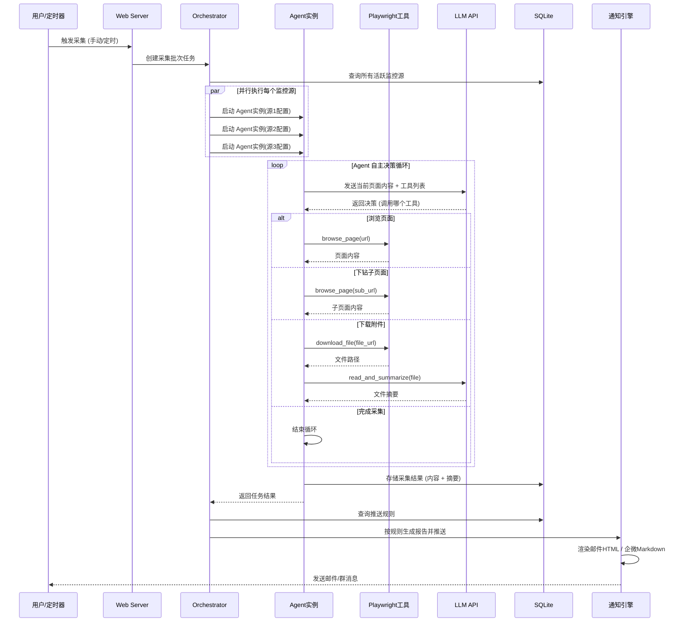
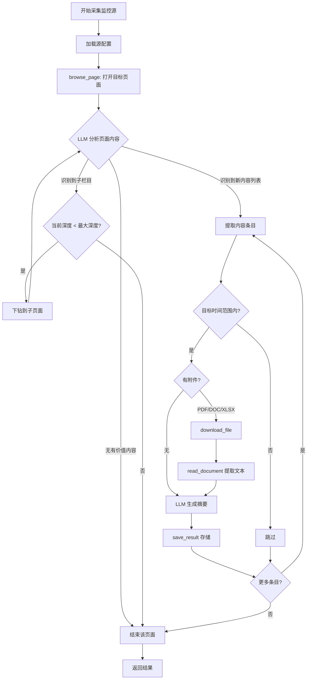

# 政策情报助手 - 产品需求文档 (PRD)

> **版本**: v1.0
> **日期**: 2026-01-29
> **状态**: 待开发

---

## 1. 核心目标

为咨询顾问构建一个智能政策情报助手，通过 AI Agent 自动采集政府网站的最新政策、新闻和文件，生成结构化摘要并推送，帮助顾问高效追踪行业政策动态。

## 2. 用户画像

| 维度 | 描述 |
|------|------|
| **目标用户** | 中大咨询公司的咨询顾问 |
| **公司背景** | 广东中大管理咨询集团，提供"咨询+培训+数字化"一体化解决方案，重点服务能源、建筑、城投等行业 |
| **核心痛点** | 需要定期关注多个政府网站的政策动态，手动浏览耗时且容易遗漏关键政策变化 |
| **期望价值** | 每周自动获取一份结构化的政策情报摘要，节省大量信息收集时间 |
| **使用场景** | 为客户提供战略咨询时，快速了解相关行业的最新政策导向 |
| **用户角色** | 管理员（Web 后台操作）+ 消费者（接收邮件/群消息） |

## 3. 版本规划

### V1 MVP 功能列表

#### 3.1 监控源管理
- 添加/编辑/删除政府网站监控源（URL + 名称 + 关注栏目）
- 每个监控源独立配置：关注栏目、探索深度、内容类型过滤
- MVP 预置 3 个默认监控源：
  1. **国家能源局**: https://www.nea.gov.cn/
  2. **国务院国资委**: http://www.sasac.gov.cn/
  3. **共产党员网**: https://www.12371.cn/

#### 3.2 AI Agent 智能采集
- **一源一 Agent**：每个监控源由独立的 Agent 实例处理，多个 Agent 并行执行
- **搜索能力**：浏览目标网站，智能下钻多级页面（2-3 级），识别目标时间范围内的新增内容
- **附件处理**：自动识别并下载 PDF、DOC/DOCX、XLSX 格式附件
- **AI 摘要**：对新闻正文和附件内容生成结构化摘要
- **Playwright 工具封装**：浏览器自动化操作封装为 Agent 可多次调用的工具集

#### 3.3 LLM 配置模块
- 用户可配置 AI 模型 API 参数：`api_url`、`api_key`、`model_name`
- 兼容 OpenAI-compatible API（支持 OpenAI / Claude / DeepSeek / 通义千问等）
- 配置校验与连通性测试
- MVP 默认 AI 配置（通义千问 qwen3-max）：
  - `api_url`: `https://dashscope.aliyuncs.com/compatible-mode/v1/chat/completions`
  - `api_key`: `sk-2df01e5ac46949ae8f7c97325c3ac995`
  - `model_name`: `qwen3-max`
  - **注意**：API Key 为敏感信息，运行时应存储在 `.env` 文件中，不可提交到版本控制

#### 3.4 摘要报告
- 按监控源分组的结构化摘要（标题 + 日期 + 摘要 + 原文链接）
- 附件摘要（文件名 + 文件类型 + 摘要 + 下载链接）
- Web 页面查看历史报告
- 报告按周归档

#### 3.5 任务调度
- 支持手动触发采集任务（全部源 / 单个源）
- 支持定时任务（用户自定义 Cron 表达式）
- 任务执行状态实时查看（待执行/执行中/已完成/失败）
- 任务执行日志

#### 3.6 推送规则
- 监控源与接收人的灵活映射
- 支持单源推送和多源组合推送
- MVP 阶段支持邮件通知（SMTP 配置）
- 邮件内含原文跳转链接和附件下载链接

#### 3.7 邮件通知
- SMTP 服务器配置（host、port、用户名、密码）
- 采集完成后按推送规则自动发送摘要邮件
- HTML 格式邮件，结构清晰、排版友好

### V2+ 后续版本功能

- 企业微信 Webhook 通知渠道
- 多用户支持 + 角色权限管理
- 关键词/主题订阅过滤（只推送用户关注的特定领域）
- 政策影响分析（AI 深度解读，关联行业影响评估）
- 历史政策趋势分析与可视化
- 多渠道通知（用户自选邮件/企微/钉钉）
- Docker 容器化部署
- 监控源模板市场（共享常用政府网站配置）

## 4. 关键业务逻辑

### 4.1 采集任务主流程

```
用户配置监控源 → 定时/手动触发采集 → Orchestrator 创建批次任务
  → 为每个活跃监控源启动独立 Agent 实例（并行执行）
  → 每个 Agent 自主决策循环：
    → LLM 分析当前页面 → 决定下一步操作
    → 操作选项：浏览子页面 / 下载附件 / 提取内容 / 结束
  → Agent 完成后返回结构化结果
  → Orchestrator 汇总所有 Agent 结果
  → 按推送规则生成报告 → 分发到对应渠道（邮件/群消息）
```

### 4.2 Agent 决策逻辑

每个 Agent 实例的工作流程：

1. **初始化**：加载监控源配置（URL、关注栏目、最大探索深度）
2. **打开首页**：调用 `browse_page(url)` 加载目标网站
3. **LLM 分析**：将页面内容发送给 LLM，由 LLM 决定：
   - 识别到新内容列表 → 提取内容条目
   - 识别到值得深入的子栏目 → 下钻（受最大深度限制）
   - 无有价值内容 → 结束当前页面
4. **内容过滤**：判断内容是否在目标时间范围内
5. **附件处理**：如有附件（PDF/DOC/XLSX），下载并提取文本
6. **生成摘要**：调用 LLM 为每条内容和附件生成摘要
7. **存储结果**：将结构化结果写入数据库

### 4.3 推送规则逻辑

```
推送规则示例：
规则1: [国家能源局] → 邮件推送 → 能源组顾问 (a@zd.com, b@zd.com)
规则2: [住建部]     → 邮件推送 → 建筑组顾问 (c@zd.com, d@zd.com)
规则3: [能源局 + 国资委] → 组合推送 → 国企能源项目组 (e@zd.com)
规则4: [全部源]     → 企微群消息 → webhook_url (V2)
```

## 5. 数据契约

### MonitorSource（监控源）

| 字段 | 类型 | 说明 |
|------|------|------|
| id | Integer (PK) | 主键 |
| name | String | 监控源名称（如"国家能源局"） |
| url | String | 目标网站 URL |
| description | Text | 描述 |
| focus_areas | JSON | 关注栏目/关键词列表 |
| max_depth | Integer | 最大探索深度（默认 3） |
| content_types | JSON | 关注的内容类型（news/policy/notice/file） |
| schedule | String | Cron 表达式（如 "0 9 * * 1" 每周一9点） |
| is_active | Boolean | 是否启用 |
| created_at | DateTime | 创建时间 |
| updated_at | DateTime | 更新时间 |

### CrawlTask（采集任务）

| 字段 | 类型 | 说明 |
|------|------|------|
| id | Integer (PK) | 主键 |
| batch_id | String | 批次ID（同一次触发的多个源共享） |
| source_id | Integer (FK) | 关联监控源 |
| status | Enum | pending / running / completed / failed |
| triggered_by | Enum | manual / scheduled |
| started_at | DateTime | 开始时间 |
| completed_at | DateTime | 完成时间 |
| items_found | Integer | 发现的内容条数 |
| error_log | Text | 错误日志 |

### CrawlResult（采集结果）

| 字段 | 类型 | 说明 |
|------|------|------|
| id | Integer (PK) | 主键 |
| task_id | Integer (FK) | 关联采集任务 |
| source_id | Integer (FK) | 关联监控源 |
| title | String | 内容标题 |
| url | String | 原文链接 |
| content_type | Enum | news / policy / notice / file |
| summary | Text | AI 生成的摘要 |
| original_text | Text | 原文内容（截取） |
| has_attachment | Boolean | 是否有附件 |
| attachment_name | String | 附件文件名 |
| attachment_type | String | 附件格式（pdf/doc/docx/xlsx） |
| attachment_path | String | 附件本地存储路径 |
| attachment_summary | Text | 附件摘要 |
| published_date | Date | 内容发布日期 |
| crawled_at | DateTime | 采集时间 |

### Report（推送报告）

| 字段 | 类型 | 说明 |
|------|------|------|
| id | Integer (PK) | 主键 |
| batch_id | String | 关联批次ID |
| title | String | 报告标题（如"第4周政策情报周报"） |
| content_html | Text | HTML 格式内容（用于邮件和Web显示） |
| content_text | Text | 纯文本格式（用于群消息） |
| generated_at | DateTime | 生成时间 |

### PushRule（推送规则）

| 字段 | 类型 | 说明 |
|------|------|------|
| id | Integer (PK) | 主键 |
| name | String | 规则名称 |
| source_ids | JSON | 关联的监控源ID列表（支持多源组合） |
| channel | Enum | email / wechat_webhook |
| recipients | JSON | 邮件地址列表 或 Webhook URL |
| is_active | Boolean | 是否启用 |
| created_at | DateTime | 创建时间 |

### LLMConfig（模型配置）

| 字段 | 类型 | 说明 |
|------|------|------|
| id | Integer (PK) | 主键 |
| name | String | 配置名称（如"通义千问 qwen3-max"） |
| api_url | String | API 端点 URL |
| api_key | String (加密) | API Key（加密存储） |
| model_name | String | 模型名称 |
| is_active | Boolean | 是否为当前使用的配置 |
| created_at | DateTime | 创建时间 |

**MVP 默认数据**：

| name | api_url | model_name |
|------|---------|------------|
| 通义千问 qwen3-max | `https://dashscope.aliyuncs.com/compatible-mode/v1/chat/completions` | `qwen3-max` |

### EmailConfig（邮件配置）

| 字段 | 类型 | 说明 |
|------|------|------|
| id | Integer (PK) | 主键 |
| smtp_host | String | SMTP 服务器地址 |
| smtp_port | Integer | SMTP 端口 |
| use_tls | Boolean | 是否使用 TLS |
| username | String | 登录用户名 |
| password | String (加密) | 登录密码（加密存储） |
| sender_email | String | 发件人邮箱地址 |
| sender_name | String | 发件人显示名称 |

## 6. UI 设计

### 6.1 整体布局：Dashboard 总览型

管理员 Web 界面采用左侧导航 + 右侧内容区的 Dashboard 布局。

**页面结构**：
- **总览页（Dashboard）**：本周概览统计 + 监控源状态 + 最新内容摘要
- **监控源管理**：添加/编辑/删除监控源，每个源独立配置
- **报告中心**：按周归档的历史报告，支持详情查看
- **任务管理**：任务执行状态、日志查看
- **推送规则**：配置源与接收人的映射关系
- **系统设置**：LLM 配置、邮件配置

### 6.2 Dashboard 页面原型

```
+---------------------------------------------------------------------+
|  政策情报助手                          [手动采集] [设置]              |
+----------+----------------------------------------------------------+
|          |                                                           |
|  导航栏   |  +-----------------------------------------------------+ |
|          |  | 本周概览                                              | |
|  > 总览   |  |                                                      | |
|  > 监控源 |  |  新增内容: 23 条  |  政策文件: 5 份  |  待阅: 18    | |
|  > 报告   |  |  上次采集: 2026-01-27 09:00                          | |
|  > 任务   |  +-----------------------------------------------------+ |
|  > 推送   |                                                           |
|  > 设置   |  +-----------------------------------------------------+ |
|          |  | 监控源状态                                             | |
|          |  |                                                      | |
|          |  |  [ok] 国家能源局     上次: 01-27  新增: 8 条          | |
|          |  |  [ok] 住建部         上次: 01-27  新增: 12 条         | |
|          |  |  [!!] 国资委         上次: 01-20  采集失败            | |
|          |  +-----------------------------------------------------+ |
|          |                                                           |
|          |  +-----------------------------------------------------+ |
|          |  | 最新内容摘要                                          | |
|          |  |                                                      | |
|          |  |  [能源局] 关于印发《2026年能源工作指导意见》          | |
|          |  |  摘要: 文件提出加快推进新型电力系统建设...            | |
|          |  |  [查看原文] [查看附件] [查看完整摘要]                 | |
|          |  |  -------------------------------------------------  | |
|          |  |  [住建部] 住房城乡建设部关于加强工程质量...           | |
|          |  |  摘要: 通知要求各地进一步落实工程质量...              | |
|          |  |  [查看原文] [查看完整摘要]                            | |
|          |  +-----------------------------------------------------+ |
|          |                                                           |
+----------+----------------------------------------------------------+
```

### 6.3 邮件推送排版

```
+-----------------------------------------------------------+
|                                                            |
|  政策情报周报 | 2026年第4周 (01/20 - 01/26)               |
|                                                            |
|  ========================================================  |
|                                                            |
|  | 国家能源局 - 本周 8 条更新                              |
|  --------------------------------------------------------  |
|                                                            |
|  [文件] 关于印发《2026年能源工作指导意见》的通知           |
|  发布日期：2026-01-22                                      |
|                                                            |
|  摘要：文件明确2026年能源工作五大重点方向：                |
|  1. 加快构建新型电力系统                                   |
|  2. 推进能源绿色低碳转型                                   |
|  3. 深化能源市场化改革                                     |
|  4. 加强能源科技创新                                       |
|  5. 提升能源安全保障能力                                   |
|                                                            |
|  附件: 2026年能源工作指导意见.pdf (32页)                   |
|  附件摘要: 全文分为总体要求、重点任务、保障措施三部分...   |
|                                                            |
|  [查看原文]  [下载附件]                                    |
|                                                            |
|  - - - - - - - - - - - - - - - - - - - - - - - - - - - -  |
|                                                            |
|  [新闻] 国家能源局发布1-12月全国电力工业统计数据           |
|  发布日期：2026-01-23                                      |
|                                                            |
|  摘要：2025年全国发电装机容量达到XX亿千瓦...               |
|                                                            |
|  [查看原文]                                                |
|                                                            |
|  ========================================================  |
|                                                            |
|  此邮件由政策情报助手自动生成 (AI摘要仅供参考)             |
|  管理订阅: http://localhost:8000/settings                  |
|                                                            |
+-----------------------------------------------------------+
```

### 6.4 企业微信群消息排版 (V2)

```
政策情报周报 | 第4周 (01/20-01/26)

== 国家能源局 (8条更新) ==

1. 关于印发《2026年能源工作指导意见》的通知
   2026-01-22 | 含附件
   > 文件明确五大重点：新型电力系统、绿色低碳转型、
   > 市场化改革、科技创新、安全保障
   原文链接

2. 1-12月全国电力工业统计数据
   2026-01-23
   > 2025年全国发电装机容量达到XX亿千瓦...
   原文链接

... (更多)

-----
完整报告: http://localhost:8000/reports/4
```

## 7. 架构设计

### 7.1 整体架构：Multi-Agent + Tools

采用"一源一 Agent"的多 Agent 架构，每个监控源由独立的 Agent 实例处理，通过 Orchestrator 并行调度。

```
定时调度器 / 手动触发
  |
  v
Orchestrator (编排器)
  |
  +---> Agent 实例 1 (国家能源局) ---> 独立采集+分析 ---> 结果
  +---> Agent 实例 2 (住建部)     ---> 独立采集+分析 ---> 结果
  +---> Agent 实例 3 (国资委)     ---> 独立采集+分析 ---> 结果
  |                                                       |
  |  (各自拥有相同的工具集，但配置不同)                    |
  |                                                       v
  |                                                  汇总引擎
  |                                            (按推送规则组合)
  +---------------------------------------------> 推送分发
                                                   +-- 邮件 (HTML)
                                                   +-- 企微 Webhook (V2)
```

### 7.2 Agent 实现：自建轻量 Agent Runtime

不依赖第三方 Agent 框架（LangGraph/CrewAI），基于 LLM Function Calling 自建轻量 Agent 运行时：

```
Agent Runtime 循环：
  1. 构造消息：System Prompt + 历史消息 + 当前页面内容
  2. 调用 LLM（with tools/functions 定义）
  3. 解析响应：
     - 如果是 tool_call → 执行对应工具 → 将结果加入历史 → 回到步骤1
     - 如果是文本响应 → 解析为结构化结果 → 结束
  4. 超过最大轮次 → 强制结束
```

### 7.3 Agent 工具集

| 工具名称 | 功能 | 参数 |
|----------|------|------|
| `browse_page` | 使用 Playwright 加载网页，返回页面文本内容 | `url: string` |
| `extract_links` | 提取当前页面的所有链接及其文本 | `page_content: string` |
| `download_file` | 下载指定 URL 的文件到本地 | `url: string, filename: string` |
| `read_document` | 读取本地文件并提取文本（支持 PDF/DOC/DOCX/XLSX） | `file_path: string` |
| `save_result` | 保存一条采集结果 | `title, url, summary, content_type, ...` |
| `finish` | 标记当前源采集完成 | `summary: string` |

**文件格式支持**：
- **PDF**: PyMuPDF (fitz) 提取文本和表格
- **DOC/DOCX**: python-docx 提取文本和表格
- **XLSX**: openpyxl 提取工作表数据，转换为文本描述

### 7.4 核心流程图

#### 采集任务主流程 (Mermaid)



#### Agent 决策流程 (Mermaid)



### 7.5 项目目录结构

```
web_monitor/
├── app/
│   ├── __init__.py
│   ├── main.py                  # FastAPI 应用入口
│   ├── config.py                # 应用配置
│   │
│   ├── models/                  # 数据模型 (SQLAlchemy ORM)
│   │   ├── __init__.py
│   │   ├── source.py            # MonitorSource
│   │   ├── task.py              # CrawlTask
│   │   ├── result.py            # CrawlResult
│   │   ├── report.py            # Report
│   │   ├── push_rule.py         # PushRule
│   │   └── settings.py          # LLMConfig, EmailConfig
│   │
│   ├── agent/                   # AI Agent 核心
│   │   ├── __init__.py
│   │   ├── runtime.py           # Agent 运行时 (LLM调用 + Tool调度循环)
│   │   ├── orchestrator.py      # 编排器 (并行管理多个Agent实例)
│   │   ├── prompts.py           # Agent System Prompts
│   │   └── tools/               # Agent 可调用的工具集
│   │       ├── __init__.py
│   │       ├── browser.py       # Playwright 封装 (browse_page)
│   │       ├── downloader.py    # 文件下载 (download_file)
│   │       ├── document.py      # 文档解析 (PDF/DOC/DOCX/XLSX)
│   │       └── summarizer.py    # LLM 摘要 (summarize)
│   │
│   ├── llm/                     # LLM 客户端抽象层
│   │   ├── __init__.py
│   │   ├── client.py            # 统一 LLM Client (OpenAI-compatible)
│   │   └── schemas.py           # Function Calling Tool Schema
│   │
│   ├── scheduler/               # 任务调度
│   │   ├── __init__.py
│   │   └── scheduler.py         # APScheduler 定时任务管理
│   │
│   ├── notification/            # 通知推送
│   │   ├── __init__.py
│   │   ├── engine.py            # 推送引擎 (按规则分发)
│   │   ├── email_sender.py      # 邮件发送 (SMTP)
│   │   ├── wechat_webhook.py    # 企微 Webhook (V2)
│   │   └── templates/           # 推送模板
│   │       ├── email_report.html
│   │       └── wechat_report.md
│   │
│   ├── api/                     # REST API 路由
│   │   ├── __init__.py
│   │   ├── sources.py           # 监控源 CRUD
│   │   ├── tasks.py             # 任务管理 (触发/查询)
│   │   ├── reports.py           # 报告查看
│   │   ├── push_rules.py        # 推送规则管理
│   │   └── settings.py          # 系统设置 (LLM/邮件配置)
│   │
│   ├── web/                     # Web 前端页面
│   │   ├── __init__.py
│   │   ├── routes.py            # 页面路由
│   │   ├── templates/           # Jinja2 模板
│   │   │   ├── base.html
│   │   │   ├── dashboard.html
│   │   │   ├── sources.html
│   │   │   ├── source_edit.html
│   │   │   ├── reports.html
│   │   │   ├── report_detail.html
│   │   │   ├── tasks.html
│   │   │   ├── push_rules.html
│   │   │   └── settings.html
│   │   └── static/
│   │       ├── css/
│   │       └── js/
│   │
│   └── database/                # 数据库
│       ├── __init__.py
│       ├── connection.py        # SQLite 连接管理
│       └── migrations.py        # 初始化/迁移
│
├── data/                        # 运行时数据
│   ├── db.sqlite                # SQLite 数据库
│   └── downloads/               # 下载的附件
│
├── requirements.txt
├── .env.example
└── Prd.md                       # 本文档
```

### 7.6 组件交互关系

| 模块 | 职责 | 依赖 | 被依赖 |
|------|------|------|--------|
| `agent/runtime.py` | Agent 运行循环 | `llm/client.py`, `agent/tools/*` | `agent/orchestrator.py` |
| `agent/orchestrator.py` | 并行管理多个 Agent | `agent/runtime.py`, `models/*` | `api/tasks.py`, `scheduler/` |
| `agent/tools/browser.py` | Playwright 浏览器操作 | playwright | `agent/runtime.py` |
| `agent/tools/document.py` | 文档文本提取 | PyMuPDF, python-docx, openpyxl | `agent/runtime.py` |
| `llm/client.py` | 统一 LLM 调用接口 | openai SDK | `agent/runtime.py`, `tools/summarizer.py` |
| `notification/engine.py` | 按推送规则分发报告 | `email_sender.py`, `wechat_webhook.py` | `agent/orchestrator.py` |
| `scheduler/scheduler.py` | 定时任务管理 | apscheduler | `main.py` |
| `web/routes.py` | 渲染页面 | Jinja2, `models/*` | `main.py` |
| `api/*` | REST API | `models/*`, `orchestrator.py` | `web/` (HTMX) |

## 8. 技术选型

| 领域 | 选型 | 理由 |
|------|------|------|
| Web 框架 | **FastAPI** | 异步支持好，适合并行 Agent；自带 OpenAPI 文档 |
| 前端渲染 | **Jinja2 + HTMX + TailwindCSS** | 轻量全栈，无需独立前端构建，HTMX 提供动态交互 |
| 数据库 | **SQLite + SQLAlchemy** | 单用户本地部署，零配置；SQLAlchemy 方便后续迁移到 PostgreSQL |
| 浏览器自动化 | **Playwright (async)** | 现代化、原生异步、API 友好，比 Selenium 更稳定 |
| LLM 客户端 | **OpenAI Python SDK** | 绝大多数 LLM 厂商支持 OpenAI-compatible API 格式 |
| PDF 解析 | **PyMuPDF (fitz)** | 轻量高效，支持文本和表格提取 |
| DOC/DOCX 解析 | **python-docx** | 成熟稳定的 Word 文档解析库 |
| XLSX 解析 | **openpyxl** | 成熟稳定的 Excel 文件解析库 |
| 任务调度 | **APScheduler** | 进程内调度器，支持 Cron，适合本地部署 |
| 邮件发送 | **aiosmtplib** | 异步 SMTP 客户端，与 FastAPI 异步架构一致 |
| 密钥加密 | **cryptography (Fernet)** | 对 API Key 和密码进行对称加密存储 |

## 9. 风险与对策

| 风险 | 影响 | 对策 |
|------|------|------|
| 政府网站反爬/封IP | Agent 无法采集内容 | 控制访问频率（间隔 >= 2秒）；随机延迟；设置合理的 User-Agent |
| 政府网站结构变化 | 内容提取失败 | Agent 基于 LLM 理解页面语义，天然适应结构变化（非硬编码选择器） |
| LLM API 不稳定/限流 | 摘要生成失败 | 重试机制（指数退避）；降级策略（保存原文，摘要标记为"待生成"） |
| PDF/DOC 文件过大 | 内存溢出或 token 超限 | 限制文件大小（50MB）；大文件分页/分段提取摘要 |
| XLSX 数据量大 | 提取文本过长 | 只提取前 N 行数据；生成数据概述而非完整内容 |
| LLM 幻觉/摘要不准确 | 误导顾问 | 始终附带原文链接；摘要标注"AI 生成，仅供参考" |
| Playwright 资源占用 | 本地性能问题 | Agent 内串行浏览页面；复用浏览器实例；采集完毕释放资源 |
| Agent 进入死循环 | 资源耗尽 | 设置最大轮次限制（如 30 轮）；设置总超时时间 |

---

> **下一步**：待确认后开始编码实现。
